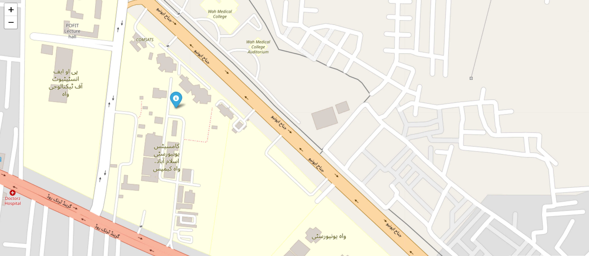

# 📍 GPS Tracker (Firebase + MIT App Inventor + Python)

This project is a **GPS tracking system** that integrates **MIT App Inventor**, **Firebase Realtime Database**, and a **Python application** for visualization.  
It allows a mobile phone to send its **current location** to Firebase, and a Python program retrieves and displays that location on an interactive map.  

---

## 🚀 Project Importance
- 🌍 **Current GPS Tracking** → Captures the mobile device's latest location.  
- 🔥 **Firebase Integration** → Stores GPS data securely in the cloud.  
- 📱 **MIT App Inventor App** → Simple Android app to send coordinates.  
- 🐍 **Python Script** → Fetches location and plots it on a map using Python libraries.  
- 🎯 **Practical Use Cases** → Useful for basic tracking demonstrations, learning Firebase integration, and Python mapping.  

---

## 🛠️ Project Structure
project-firebase-mit/
│
├── code/
│ └── gps_code.py # Python script to fetch data and show on map
│
├── images/ # Project screenshots
│ ├── img1.png
│ ├── img2.png
│ ├── img3.png
│ └── img4.png
│
└── README.md # Project documentation


---

## 🔗 Project Links

- **Firebase Database (GPS Data):**  
  [Open Firebase Console](https://console.firebase.google.com/project/gps-tracker-project-07/database/gps-tracker-project-07-default-rtdb/data)  

- **MIT App Inventor Project:**  
  [View MIT App Structure](https://ai2.appinventor.mit.edu/#4564082198904832)  

- **App for Mobile Testing:**  
  [MIT AI2 Companion – Play Store](https://play.google.com/store/apps/details?id=edu.mit.appinventor.aicompanion3)  

---

## ⚙️ How It Works
1. 📱 **Mobile App (MIT App Inventor)**  
   - User installs MIT AI2 Companion.  
   - The app sends the phone’s **current GPS location** to Firebase.  

2. 🔥 **Firebase (Cloud Storage)**  
   - Stores the received latitude and longitude values.  

3. 🐍 **Python Script**  
   - Fetches the GPS coordinates from Firebase.  
   - Displays the location on an interactive **map** using `folium`.  

---


Developed by Danyal Ahmad
📍 CS Student @ COMSATS | Passionate about Data Science & Artificial Intelligence

🔗 Connect with me:

LinkedIn : www.linkedin.com/in/danyal-ahmad-598b87294
## 📦 Python Requirements

Install the following libraries before running the script:

```bash
pip install firebase-admin
pip install folium


